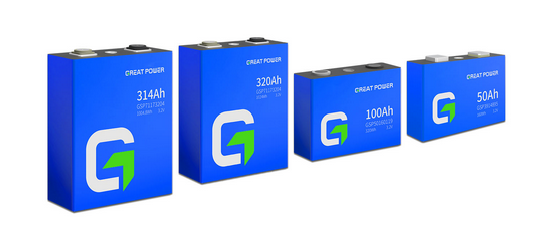

# Reneweable-Energy-Battery-System
Using Great Power polar battery cell, a simulation of a reneweable energy system was produced. Solar and Wind energy was modelled using local weather data from the 
town of Moosonee in Northern Ontario. Battery efficiency was taken and combined with 385W solar panels and 10kW wind turbine. The following results were obtained.

## Solar Modelling
The results from the simulation of the wind and solar panel systems are shown bellow: 

Then a system of solar panels where modelled based on an average roof size in the area. 
This yielded the following results: 

## Wind Modelling
Afterwards the wind speeds were analyzed and using the Tesup Atlas wind turbine yielded the following energy plot: 

## System Modelling
The system was modelled based of the battery efficiency curve over a temperature range and an efficiency of 90% for the inverter was used.
This gave the following yearly energy generation: 

