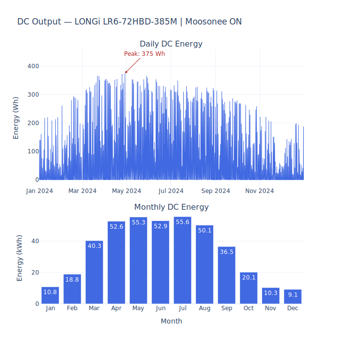
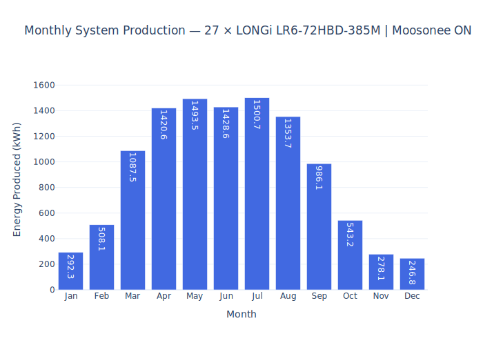
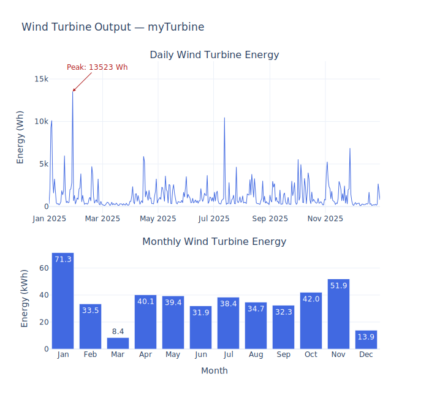
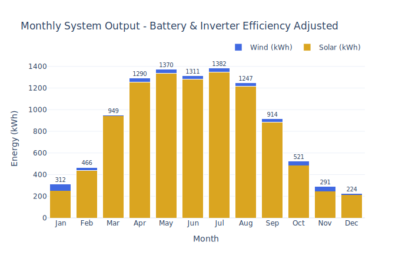

# Reneweable-Energy-Battery-System
Web gui to showcase energy inputs and outputs into a typical household in Moosonee Ontario where a cold operated battery is used with the integration of solar and wind power.

## Solar Modelling
The results from the simulation of the wind and solar panel systems are shown bellow: 

Then a system of solar panels where modelled based on an average roof size in the area. 
This yielded the following results: 

## Wind Modelling
Afterwards the wind speeds were analyzed and using the Tesup Atlas wind turbine yielded the following energy plot: 

## System Modelling
The system was modelled based of the battery efficiency curve over a temperature range and an efficiency of 90% for the inverter was used.
This gave the following yearly energy generation: 

